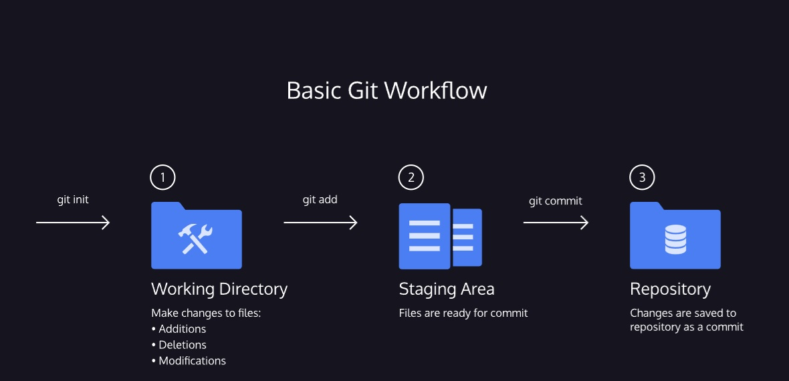

**Git Teamwork**

### Overview

So far, we’ve learned how to work on Git as a single user. Git also offers a suite of collaboration tools to make working with others on a project easier.

Imagine that you’re a science teacher, developing some quizzes with Sally, another teacher in the school. You are using Git to manage the project.

In order to collaborate, you and Sally need:

- A complete replica of the project on your own computers
- A way to keep track of and review each other’s work
- Access to a definitive project version

You can accomplish all of this by using 
Preview: Docs Loading link description
remotes
. A remote is a shared Git repository that allows multiple collaborators to work on the same Git project from different locations. Collaborators work on the project independently, and 
Preview: Docs Loading link description
merge
 changes together when they are ready to do so.

